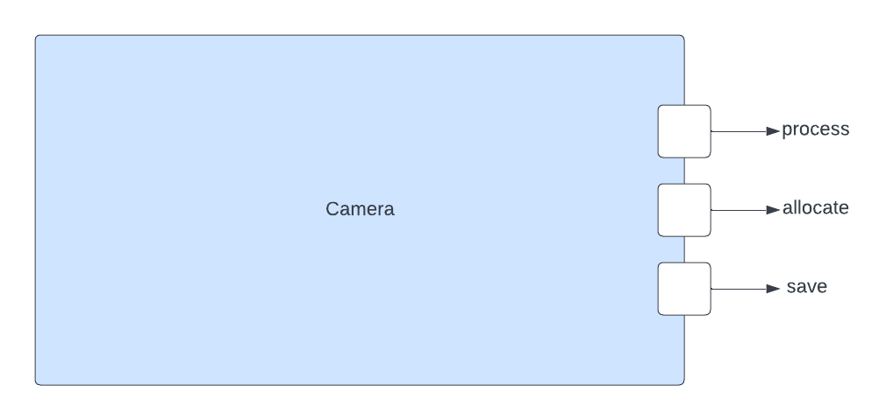

\page PayloadCameraComponent Payload::Camera Component
# Payload::Camera (Active Component)

## 1. Introduction
'Payload::Camera' is an F' active component that captures images using the Raspberry Pi Camera Module 2. 
The component uses the library opencv to interact with the camera in order to capture and process images.
More information can be found from the [data sheet](https://www.raspberrypi.com/documentation/accessories/camera.html#introducing-the-raspberry-pi-cameras),
provided by the manufacturer.

## 2. Requirements
| Requirement        | Description                                                                                      | Verification Method |
|--------------------|--------------------------------------------------------------------------------------------------|---------------------|
| PAYLOAD-CAMERA-001 | The `Payload::Camera` component shall capture images on command                                  | Inspection          |
| PAYLOAD-CAMERA-002 | The `Payload::Camera` component shall save raw image files to disk                               | Inspection          |
| PAYLOAD-CAMERA-003 | The `Payload::Camera` component shall be able to send raw images to another component to process | Inspection          |
| PAYLOAD-CAMERA-004 | The `Payload::Camera` component shall allow users to be able to set image resolution             | Unit-Test           |
| PAYLOAD-CAMERA-005 | The `Payload::Camera` component shall allows users to be able to set image color format          | Unit-Test           |
| PAYLOAD-CAMERA-006 | The `Payload::Camera` component shall allows users to set exposure time                          | Unit-Test           |

## 3. Design
The diagram below shows the `Camera` component.

### 3.2 Ports
`Camera` has the following ports:

| Kind            | Name              | Port Type       | Usage                                                             |
|-----------------|-------------------|-----------------|-------------------------------------------------------------------|
| `output`        | `process`         | `Fw.BufferSend` | Port that outputs image data to get utilized by another component |
| `output`        | `allocate`        | `Fw.BufferGet`  | Port that allocates memory to hold image buffers                  |
| `output`        | `$save`           | `Fw.BufferSend` | Port that saves image to disk                                     |

### 3.3. State
`Camera` maintains the following state:
1. m_cmdCount: `U32` type that keeps track of the number of commands executed 
2. m_photoCount: `U32` type that keeps track of the number of photos captured 
3. m_validCommand: An instance of `bool` that indicates weather a valid command was received or not 
4. m_capture: An instance of `cv::VideoCapture` that stores the captured image frame
5. m_imageFrame: An instance of `cv::Mat` that stores the image matrix

### 3.4. Port Handlers

#### 3.4.1 TakeAction
The `takeAction` port handler does the following:
1. Reads the image frame
2. Determines whether the image gets saved to disk or sent to the buffer logger 

#### 3.4.2 ExposureTime
The `ExposureTime` port handler does the following:
1. Set the exposure time of the camera

#### 3.4.3 ConfigImg
The `ConfigImg` port handler does the following:
1. Sets the resolution of the image
2. Sets the color format of the image

### 3.5. Helper Functions

#### 3.5.1 open
Activates the camera and ensures that it is open.

## 4. Sequence Diagram

## 5. Change Log

| Date       | Description   |
|------------|---------------|
| 2022-07-19 | Initial Draft |
| 2022-08-3  | Edit          |